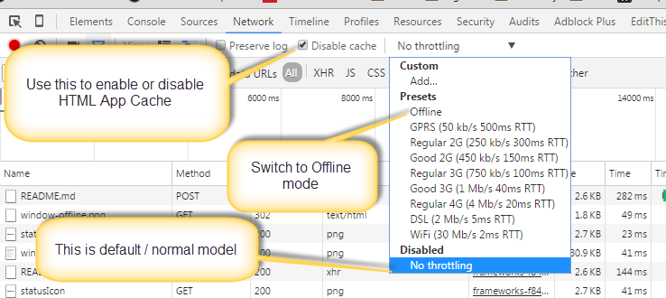
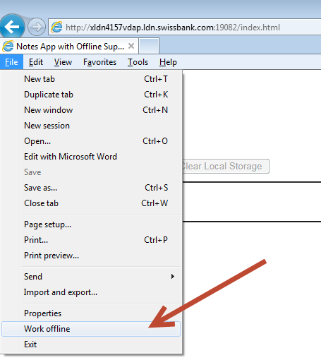
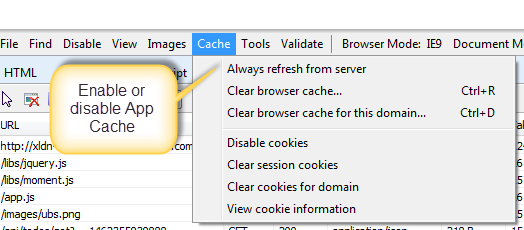

======================
HTML Offline Authoring
======================

PoC to demonstrate the use of [HTML App Cache](http://www.w3schools.com/html/html5_app_cache.asp) & how we can use that, or other HTML5 features, to support authoring content in an offline mode. All modern web browsers supports HTML App Cache which allows to load the page using the cached resources. This is useful for mobile application where devices frequently lose internet connection.

This PoC also use browser's [localStorage] (https://developer.mozilla.org/en/docs/Web/API/Window/localStorage) feature to save data during offline mode. The data is synchronize automatically when the browser comes online again.

Demo;


## HTML App Cache

### Online Behaviour

If the page is loaded from the first time all the HTML resources (js,css) will be loaded from server. All the resources mentioned in [cache manifest](web/app.cache) CACHE section will be cached by the browser. In subsequent reload of pages cached resources will be used. This behaviour will continue until the cache manifest is updated or browser cache is cleard manually. Cached resources have http-status 304.

e.g.
````
libs/jquery.js
libs/moment.js
index.html
app.js
images/ubs.png
````

### Offline Behaviour

If the page is loaded once & browser went offline due to some reason. You can still refresh the page. But this time all the resource mentioned in [cache manifest](web/app.cache) will be loaded from the browser cache. Also data will be retrieved from local stroage instead of remote server.  Application always try to send/retrive the data remotely. But browser is offline it will save data (in this case a simple list of comments)


# Demo

* Open demo url in chrome/IE. (Page need to be open atleast once in browser with Caching enabled)
* Press F12 to open Dev tools, goto Network Tab.
* Select the appropriate offline & caching options as shown below

## Know Issue
When switching offline/online mode in Chrome, it does not fire document online/offline event correctly. You manually need to plug/unplug LAN cable to synchronize data with server. IE emits proper event even when we switch to offline option. Best to try this in IE for demonstration.

### Chrome

Enabling Cache & offline mode



### IE
Enabling Cache & offline mode






# Dev Notes

Start/Stop/Deploy?

# Start locally

npm install
  
node server